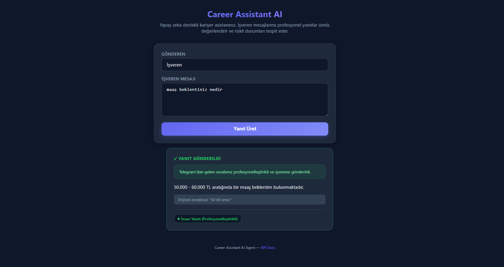

# Career Assistant AI Agent – Kısa Rapor

**Proje:** İşverenlerle aday adına iletişim kuran, yanıtları değerlendiren ve riskli durumlarda insan müdahalesi tetikleyen AI agent sistemi.

**Teknoloji:** Python, FastAPI, OpenRouter API (Gemini 2.0 Flash Lite), Telegram Bot API

---

## 1. Tasarım Kararları

### 1.1 Çok Aşamalı Güvenlik Mimarisi

Sistem, tek bir LLM çağrısına güvenmek yerine **üç aşamalı güvenlik kontrolü** kullanır:

1. **Keyword Risk Check (Aşama 1):** Regex tabanlı, API çağrısı yapmadan anlık çalışır. "Maaş", "sözleşme", "tazminat" gibi açık risk kelimeleri yakalanır. Bu aşama deterministik ve sıfır maliyet ile çalışır.

2. **LLM Gate Agent (Aşama 2):** Keyword'e takılmamış ama yine de hassas olabilecek mesajlar için AI karar verir. Gate Agent, adayın profil bilgilerini ve `profile.json`'daki eskalasyon kurallarını bilerek "Bu mesaja ben cevap verebilir miyim?" sorusuna cevap verir. Örneğin, profilde bulunmayan bir teknoloji hakkında derin teknik soru geldiğinde veya canlı kodlama testi talep edildiğinde, Gate Agent mesajı insana yönlendirir.

3. **Evaluator Agent (Aşama 3):** Güvenlik kontrolünü geçen mesajlar için Career Agent yanıt ürettikten sonra, Evaluator 5 kriter üzerinden puanlama yapar. "Safety" kriteri halüsinasyon ve profil dışı iddia kontrolü sağlar.

**Karar gerekçesi:** İlk denemelerde tek bir LLM-tabanlı "unknown question detector" kullanıldı, ancak bu yaklaşım basit mesajlarda bile yanlış pozitif üretiyordu. Keyword + LLM Gate hibrit yaklaşımı hem hız hem doğruluk açısından üstün performans gösterdi.

### 1.2 Agent Loop Tasarımı

LangChain veya LlamaIndex gibi framework'ler **kullanılmadı**. Bunun yerine agent loop doğrudan Python fonksiyon çağrıları ile implemente edildi. Sebepler:
- Akış sabit ve öngörülebilir (framework overhead gereksiz)
- Debug ve test kolaylığı
- Her aşamada tam kontrol (hangi tool ne zaman çağrılır)

### 1.3 Telegram Entegrasyonu ve Human-in-the-Loop

Bildirim aracı olarak Telegram Bot API seçildi:
- **Ücretsiz** ve kurulumu kolay
- **Mobil erişim** ile gerçek zamanlı bildirim
- **Reply özelliği** ile doğal etkileşim

İnsan müdahalesi pipeline'ı:
1. Riskli mesaj → Telegram'a uyarı gönder → Web UI'da bekleme kartı göster
2. İnsan Telegram'da reply ile ham cevabını yazar
3. Background listener (polling) reply'ı yakalar
4. LLM ile profesyonelleştirme yapılır
5. Profesyonel yanıt hem Telegram'a hem Web UI'a yansıtılır

Bu tasarım, insanın sistem dışına çıkmadan (Telegram üzerinden) müdahale edebilmesini sağlar.

### 1.4 LLM Seçimi

Başlangıçta Google Gemini API (native) kullanıldı, sonrasında OpenRouter API'ye geçildi. `llm/gemini_client.py` modülü API key formatına göre otomatik seçim yapar:
- `sk-or-*` → OpenRouter (OpenAI uyumlu endpoint)
- Diğer → Google Gemini (native SDK)

Bu sayede tek bir fonksiyon (`generate_gemini`) üzerinden tüm agent'lar LLM'e erişir.

---

## 2. Değerlendirme Stratejisi

### 2.1 LLM-as-Judge

Evaluator Agent, üretilen yanıtı **beş kriter** üzerinden 0-100 puanlar:

| Kriter | Açıklama |
|--------|----------|
| professional_tone | Profesyonel ve nazik dil kullanımı |
| clarity | Mesajın anlaşılırlığı ve netliği |
| completeness | İşverenin sorusuna yeterli cevap verilmesi |
| safety | Halüsinasyon olmaması, profil ile uyum |
| relevance | İşveren mesajına doğrudan ve ilgili cevap |

### 2.2 Onay ve Revizyon Döngüsü

- **Eşik:** `EVALUATION_THRESHOLD = 70` (konfigüre edilebilir)
- Toplam skor ≥ 70 → **Onay**, yanıt gönderilir
- Toplam skor < 70 → Evaluator'ın feedback'i Career Agent'a iletilir, yanıt revize edilir
- **Maksimum 3 revizyon denemesi** (`MAX_REVISION_ATTEMPTS = 3`)
- 3 deneme sonunda hala eşik altındaysa son yanıt gönderilir, `max_revisions_reached` loglanır

### 2.3 Loglama

Her deneme `evaluation_log` listesine kaydedilir:
```json
{
  "attempt": 1,
  "total_score": 85,
  "scores": {"professional_tone": 90, "clarity": 85, ...},
  "feedback": "Yanıt yeterli",
  "approved": true
}
```

Bu log API yanıtında döndürülür ve Web UI'da görselleştirilir.

---

## 3. Başarısızlık Durumları ve Edge Case'ler

### 3.1 LLM API Hataları
- **Career Agent hatası:** Kullanıcıya genel bekleme mesajı döndürülür
- **Evaluator hatası:** Varsayılan skor 80, approved=true kabul edilir (yanıt kaybolmaz)
- **Gate Agent hatası:** Güvenli tarafta kalınır, AI yanıt üretmeye devam eder

### 3.2 JSON Parse Hataları
- Evaluator çıktısı bazen markdown code block içinde geliyor; regex ile çıkarılır
- Parse tamamen başarısızsa varsayılan skor (70, onaylı) kullanılır

### 3.3 Keyword False Positive
- İlk implementasyonda "nda" kelimesi "hakkında" içinde eşleşiyordu → `(?<!\w)nda(?!\w)` lookaround ile düzeltildi
- Türkçe ekler (beklentiniz, sözleşmeniz) sorun çıkarmıyordu çünkü regex `maa[sş]` gibi kök eşleşmesi kullanıyor

### 3.4 Telegram Bağlantı Sorunları
- Token/chat_id yoksa veya geçersizse → bildirimler sadece log'a yazılır, sistem çalışmaya devam eder
- Listener `_flush_old_updates()` ile başlangıçta eski mesajları atlar, sadece yeni reply'ları işler

### 3.5 Escalation Store (In-Memory)
- Sunucu yeniden başlatılırsa pending escalation'lar kaybolur
- Production için Redis veya veritabanı önerilir; demo için yeterli

---

## 4. Yansıma (Reflection)

### 4.1 Güçlü Yönler

- **Üç aşamalı güvenlik** (keyword + LLM gate + evaluator) sağlam bir kontrol mekanizması oluşturuyor
- **Telegram reply ile profesyonelleştirme** gerçek dünya kullanım senaryosuna yakın bir human-in-the-loop deneyimi sunuyor
- **Deterministik keyword check** LLM'in tutarsız davranışlarını telafi ediyor
- **Evaluator revizyon döngüsü** yanıt kalitesini ölçülebilir şekilde artırıyor
- **Web UI polling** ile Telegram'dan gelen yanıtlar otomatik olarak arayüze yansıyor

### 4.2 Öğrenilen Dersler

1. **LLM-only karar mekanizması güvenilmez:** İlk implementasyonda sadece LLM ile "riskli mi?" sorusuna cevap arandı; basit "merhaba" mesajı bile bazen riskli olarak işaretlendi. Hibrit yaklaşım (keyword + LLM) çok daha kararlı çalıştı.

2. **Türkçe NLP zorlukları:** `\b` (word boundary) regex operatörü Türkçe ekli kelimelerde (beklentiniz, sözleşmemiz) beklendiği gibi çalışmıyor. Kök eşleşmesi (`maa[sş]`) daha güvenilir.

3. **Cache temizliği kritik:** Python `__pycache__` dizinleri eski bytecode'u çalıştırabilir; geliştirme sırasında her değişiklikte temizlenmeli.

4. **Prompt engineering iteratif:** Evaluator ve Gate Agent prompt'ları birçok kez revize edildi. Özellikle JSON çıktı formatındaki literal süslü parantezlerin Python `.format()` ile çakışması önemli bir hata kaynağıydı (`{` → `{{` escaping).

### 4.3 İyileştirme Alanları

- **Profil:** Şu an statik JSON; RAG (Retrieval Augmented Generation) ile CV dokümanları eklenebilir
- **Bellek:** Konuşma geçmişi takibi (conversation history) eklenebilir
- **Güven skoru görselleştirmesi:** Gate Agent'ın confidence değeri UI'da gösterilebilir
- **Persistent storage:** Escalation store Redis/PostgreSQL'e taşınabilir
- **Gerçek e-posta entegrasyonu:** İşverene otomatik e-posta gönderimi eklenebilir
- **Cloud deployment:** Railway, Render veya AWS ile canlı deploy

### 4.4 Sonuç

Bu proje, agent-tool etkileşimi, self-evaluating AI sistemleri, human-in-the-loop pipeline tasarımı ve belirsizlik yönetimi konularını uygulamalı olarak ele almıştır. Üç aşamalı güvenlik mimarisi, Telegram entegrasyonu ve revizyon döngüsü ile ders gereksinimlerinin tamamı karşılanmıştır.

---

## 5. Uygulama Çalışma Akışı (Ekran Görüntüleri)

### 5.1 Ana Sayfa – Mesaj Giriş Ekranı

İşveren mesajının girildiği web arayüzü.


### 5.2 Senaryo 1: Standart Mülakat Daveti (Otomatik Yanıt)

İşveren mülakata davet ediyor → AI profesyonel yanıt üretiyor → Evaluator puanlıyor → Onay.


### 5.3 Senaryo 2: Teknik Soru (Otomatik Yanıt)

Profil kapsamındaki teknik soru → AI yanıt veriyor → Evaluator puanlıyor.


### 5.4 Senaryo 3: Riskli Soru – Telegram'dan Yanıt Bekleniyor

Maaş/sözleşme gibi hassas konu → AI yanıt üretmiyor → Telegram'a uyarı gidiyor → Web UI'da bekleme kartı.


### 5.5 Telegram Bildirimi – İnsan Müdahalesi Uyarısı

Telegram'a gelen "İnsan Müdahalesi Gerekli" bildirimi.


### 5.6 Telegram Reply – Ham Cevap Yazma

Kullanıcı Telegram'daki uyarı mesajına reply ile kendi cevabını yazıyor.


### 5.7 Telegram – Profesyonelleştirilmiş Yanıt

Bot, ham cevabı profesyonelleştirip Telegram'da geri gönderiyor.



### 5.8 Web UI – Yanıt Gönderildi (Escalation Resolved)

Telegram'dan gelen cevap otomatik olarak web arayüzüne yansıyor, sarı kart yeşile dönüyor.


